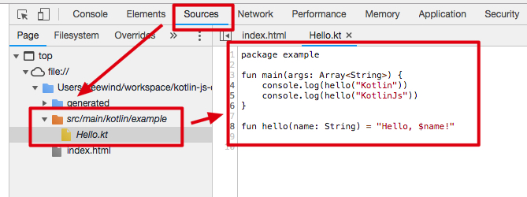
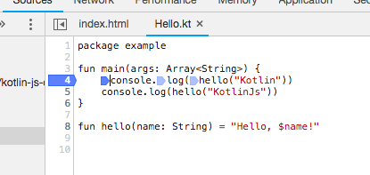
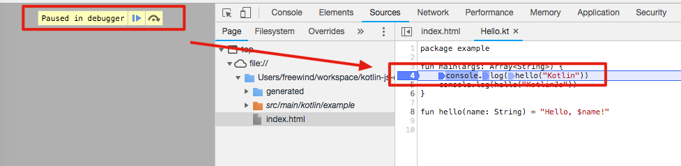
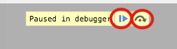

Kotlin JS 在浏览器中单步调试
===================

这个Demo的目的是要做到，在浏览器中，可以看到Kotlin源代码、设置断点、并单步调试。

关键点是在`build.gradle`中，对`compileKotlin2Js`任务进行设置：

```
compileKotlin2Js {
    kotlinOptions.sourceMap = true
    kotlinOptions.sourceMapEmbedSources = "always"
}
```

以便它生成`sourceMap`并且把Kotlin源代码也嵌进去。

编译
---

为了方便管理，我们在`build.gradle`中还设置了：

```
compileKotlin2Js {
    kotlinOptions.outputFile = "${projectDir}/generated/hello.js"
}
```

编译：

```
./gradlew compileKotlin2Js
```

打开生成的`generated/hello.js.map`，可以看到它里面的确包含了Kotlin代码：

```
{
    "version": 3,
    "file": "hello.js",
    "sources": ["../src/main/kotlin/example/Hello.kt"],
    "sourcesContent": ["package example\n\nfun main(args: Array<String>) {\n    console.log(hello(\"Kotlin\"))\n    console.log(hello(\"KotlinJs\"))\n}\n\nfun hello(name: String) = \"Hello, $name!\"\n\n"],
    "names": [],
    "mappings": ";;;;;;IAGI,OAAQ,KAAI,MAAM,QAAN,CAAJ,C;IACR,OAAQ,KAAI,MAAM,UAAN,CAAJ,C;EACZ,C;;IAE0B,mBAAS,IAAT,M;EAAA,C;;;;;;;;"
}
```

安装依赖：

```
cd generated
npm install
```

再回到根目录：

```
open index.html
```

将在浏览器中打开页面。

打开Chrome的 Developer面板 -> `Source`，可以看到的确出现了Kotlin文件：



更棒的是，我们还可以在某一行代码前面点击来设置断电：



刷新页面，就可以看到页面在该行暂停下来了：



之后，我们可以通过点击这两个按钮（或者相应的快捷键）跳出调试模式，或者单步进入下一行：



